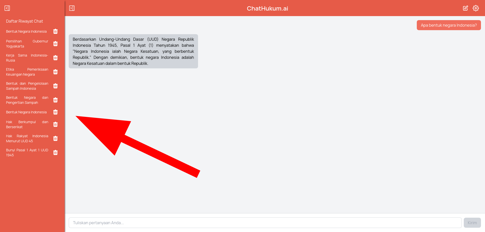

<div align="center">
<h1>
ChatHukum.ai
</h1>
</div>
ChatHukum.ai is an AI-based platform where you can ask about the contents of all laws and regulations in Indonesia. ChatHukum.ai is directly connected to 250,000+ legal documents. ChatHukum.ai is able to answer questions quickly and accurately using LLM technology.

## Tech Stack

<div syle="display: flex; justify-content: space-around;">

          
          
          
          
          
          
          
</div>

## Screenshot

<div style="display: flex; justify-content: space-around;">




</div>

## Setup Instructions

### Prerequisites

- Docker
- Docker Compose

### Cloning the Repository

```bash
git clone https://github.com/karuniaperjuangan/guesswho-webapp.git
cd guesswho-webapp
```

### Running the Application


1. Download the database from [This Link](https://drive.google.com/file/d/1C7zcIxtDTF48N-5D_u2oTxllwEZ_LU31/view?usp=sharing) and put it to `./vector-database` directory

2. Navigate to the project directory:

    ```bash
    cd guesswho-webapp
    ```
2. Create `.env` in 'frontend' folder and 'backend'. By default, you can just copy `.env.example` file to `.env

    ```bash
    cp frontend/.env.example frontend/.env
    cp backend/.env.example backend/.env
    ```

3. Build and start the containers:

    ```bash
    docker-compose --profile prod up --build 
    ```

4. Access the application:
    - Frontend: `http://localhost`
    - Backend: `http://localhost:6789`
